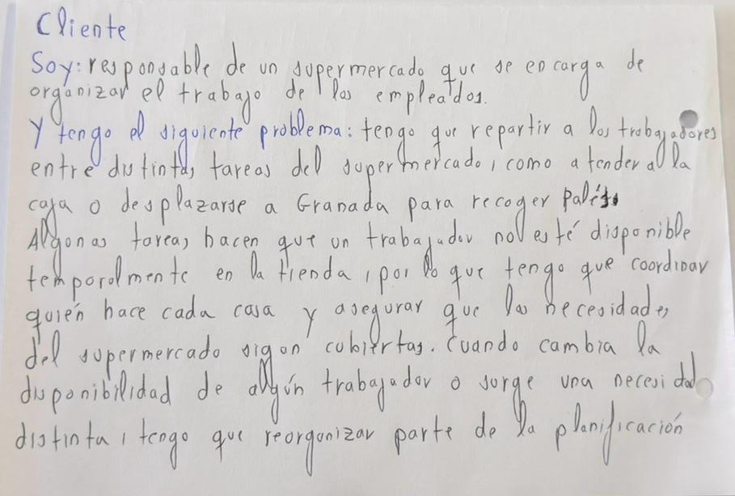

# TurnosSupermercado

## Problema

El responsable de un supermercado tiene que organizar los turnos de los trabajadores y repartir las tareas que hay que hacer cada día.

Los lunes, martes, jueves y viernes suelen ir dos trabajadores a Granada a recoger palés. Durante ese tiempo quedan menos personas disponibles en la tienda y una de ellas tiene que estar pendiente de la caja.

Si falta alguien o cambia algún turno, hay que volver a cuadrar parte del trabajo.

## De dónde viene esto

Este problema lo conozco porque mi padre es quien se encarga de organizar los turnos del supermercado. Yo también ayudo allí durante el verano, así que he visto cómo se reparte el trabajo y qué pasa cuando falta gente.

En total trabajan cinco personas. Los días que hay recogida de palés suelen salir dos a Granada y se quedan tres en la tienda.

## Cómo se organiza ahora

Los turnos se llevan en un Excel guardado en el ordenador de casa del responsable.

Cuando el cuadrante está hecho, se avisa a cada trabajador por WhatsApp. Si hay algún cambio, hay que modificar el Excel y volver a avisar a las personas afectadas.

## Un caso real

Un martes faltó uno de los trabajadores y ese mismo día ya había dos personas que tenían que ir a Granada a recoger palés.

Como quedaba menos gente en la tienda, hubo que cambiar a otro trabajador de tarea para que se quedara en caja. Ese día tuvo que dejar la reposición para quedarse cubriendo la caja.

## Datos disponibles

Para organizar los turnos se dispone de:

- los cinco trabajadores;
- los turnos de cada uno;
- su disponibilidad;
- las tareas que hay que hacer;
- los días de recogida de palés;
- qué trabajadores pueden ir a Granada.

Los turnos actuales están guardados en el Excel que utiliza el responsable.

## Qué hay que tener en cuenta

Siempre tiene que quedar alguien pendiente de la caja.

Para recoger los palés suelen ir dos trabajadores y, mientras están en Granada, no se puede contar con ellos para las tareas de la tienda.

Si falta alguien, como ocurrió ese martes, puede ser necesario cambiar el reparto que ya estaba hecho.

## Qué hace falta procesar

Para hacer el reparto hay que analizar qué trabajadores están disponibles y qué tareas hay que cubrir en cada momento.

También hay que calcular con cuántas personas se puede contar en la tienda cuando alguien falta o cuando dos trabajadores se van a Granada, y validar que siga habiendo alguien pendiente de la caja.

Si alguna de estas condiciones cambia, hay que generar un nuevo reparto de tareas teniendo en cuenta quién sigue disponible y qué tareas quedan por hacer.

## Por qué hace falta que esté en la nube

Ahora mismo el cuadrante está guardado en un Excel en el ordenador de casa del responsable, mientras que los trabajadores reciben sus turnos y los cambios por WhatsApp.

Esto hace que la planificación dependa de un único ordenador. Para consultar o modificar el cuadrante completo hay que acceder a ese equipo, aunque los avisos a los trabajadores sí puedan hacerse desde el móvil.

Tener el cuadrante accesible desde distintos dispositivos permitiría consultar y modificar la misma planificación sin depender de ese único ordenador.

## Juego de rol

## Documentación

- [Configuración del repositorio](docs/objetivo-0.md)
